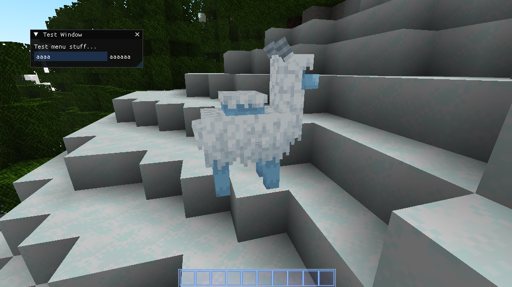

# Dear ImGui Integration Example Mod

This is the test/example mod for the Dear ImGui Integration mod. The mod opens a basic window when in a world.

Run the `./gradlew -p example runModdedClient --warning-mode all` task in the root directory of the Imgui Integration
project to run the example mod. Alternatively, run `./gradlew runModdedClient --warning-mode all` when in the example
mod's directory.

